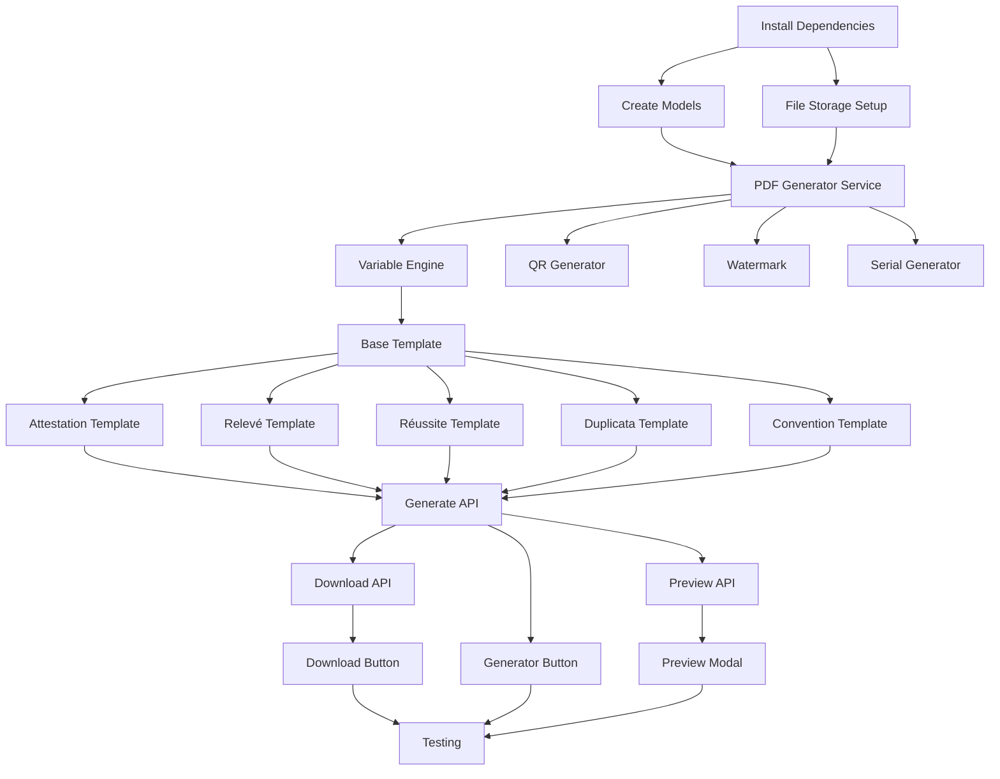

# Implementation Tasks: Document Generation & Printing

## Overview
47 tasks across 8 weeks to implement automated PDF generation for student certificates and documents.

---

## Phase 1: Foundation (Week 1) - 6 tasks

### Setup & Dependencies
- [ ] 1. Install PDF generation dependencies (@react-pdf/renderer, qrcode, sharp, handlebars)
- [ ] 2. Add environment variables for university info and document settings

### Database Schema
- [ ] 3. Create database model for document_templates collection
- [ ] 4. Create database model for generated_documents collection
- [ ] 5. Update IDemande interface to include documentGenere field

### Infrastructure
- [ ] 6. Set up file storage structure (/uploads/documents/YYYY/MM/)

---

## Phase 2: Core Services (Week 2) - 8 tasks

### PDF Generation Engine
- [ ] 7. Create PDF generator service (lib/pdf/generator.ts)
- [ ] 8. Create variable replacement engine (lib/pdf/variables.ts)
- [ ] 9. Create QR code generator utility (lib/pdf/qr-code.ts)
- [ ] 10. Create watermark overlay utility (lib/pdf/watermark.ts)
- [ ] 11. Create serial number generator with format UNI-YYYY-TYPE-NNNNNN

### Storage & Security
- [ ] 12. Create file storage service (lib/storage/documents.ts) with local filesystem support
- [ ] 13. Implement access control and authorization for document endpoints
- [ ] 14. Add audit logging for document generation and downloads

---

## Phase 3: Templates (Week 3-4) - 6 tasks

### Template Components
- [ ] 15. Design and implement base PDF template component (base-template.tsx)
- [ ] 16. Create Attestation de Scolarité template (attestation-scolarite.tsx)
- [ ] 17. Create Relevé de Notes template (releve-notes.tsx)
- [ ] 18. Create Attestation de Réussite template (attestation-reussite.tsx)
- [ ] 19. Create Duplicata Carte template (duplicata-carte.tsx)
- [ ] 20. Create Convention de Stage template (convention-stage.tsx)

---

## Phase 4: API Endpoints (Week 5) - 5 tasks

### Backend APIs
- [ ] 21. Create API endpoint POST /api/demandes/[id]/generate-document
- [ ] 22. Create API endpoint GET /api/documents/[id]/download
- [ ] 23. Create API endpoint GET /api/demandes/[id]/preview-document
- [ ] 24. Create API endpoint GET /api/templates (list templates)
- [ ] 25. Add business rule validation (only VALIDE/TRAITE status can generate)

---

## Phase 5: UI Components (Week 6) - 7 tasks

### Frontend Components
- [ ] 26. Create DocumentDownloadButton component for students
- [ ] 27. Create DocumentGeneratorButton component for admins
- [ ] 28. Create DocumentPreviewModal component with watermark
- [ ] 29. Integrate generator button in admin demande detail page
- [ ] 30. Integrate download button in student demande detail page
- [ ] 31. Create QR code verification page (/verify/[serialNumber])
- [ ] 32. Implement print functionality with browser print dialog

---

## Phase 6: Notifications & Features (Week 7) - 4 tasks

### Email Integration
- [ ] 33. Add document generation email notification to students
- [ ] 34. Create email template for document ready notification

### Admin Features
- [ ] 35. Create admin UI to view all generated documents
- [ ] 36. Add regenerate document functionality for admins

---

## Phase 7: Optimization & Error Handling (Week 7) - 4 tasks

### Performance
- [ ] 37. Add caching strategy for generated PDFs (1 hour cache)
- [ ] 38. Optimize PDF file size (compression, image optimization)

### Robustness
- [ ] 39. Implement error handling and retry logic for PDF generation
- [ ] 40. (Already part of task 39)

---

## Phase 8: Testing & Documentation (Week 8) - 7 tasks

### Automated Tests
- [ ] 41. Write unit tests for PDF generator service
- [ ] 42. Write unit tests for variable replacement engine
- [ ] 43. Write integration tests for generate-document endpoint
- [ ] 44. Write E2E test for complete document generation flow

### Manual Testing
- [ ] 45. Manual testing: verify PDF displays in Chrome/Firefox/Safari
- [ ] 46. Manual testing: verify print quality and page breaks
- [ ] 47. Manual testing: verify QR code scans and verification works

### Documentation
- [ ] 48. Document API endpoints in PROJECT_OVERVIEW.md
- [ ] 49. Create user guide for document generation feature

---

## Task Summary by Category

### 🔧 Infrastructure (9 tasks)
Tasks 1-6, 12-14

### 🎨 Templates & PDF (11 tasks)
Tasks 7-11, 15-20

### 🔌 API Development (5 tasks)
Tasks 21-25

### 🖼️ UI Components (7 tasks)
Tasks 26-32

### 📧 Notifications & Admin (4 tasks)
Tasks 33-36

### ⚡ Performance & Errors (3 tasks)
Tasks 37-39

### ✅ Testing (7 tasks)
Tasks 41-47

### 📚 Documentation (2 tasks)
Tasks 48-49

---

## Dependencies Between Tasks

---

## Critical Path (Minimum Viable Product)

To get a working MVP, focus on these tasks in order:

1. ✅ **Task 1**: Install dependencies
2. ✅ **Task 3**: Create generated_documents model
3. ✅ **Task 7**: Create PDF generator service
4. ✅ **Task 8**: Create variable engine
5. ✅ **Task 9**: QR code generator
6. ✅ **Task 11**: Serial number generator
7. ✅ **Task 15**: Base template
8. ✅ **Task 16**: Attestation de Scolarité template (most common)
9. ✅ **Task 21**: Generate API endpoint
10. ✅ **Task 22**: Download API endpoint
11. ✅ **Task 27**: Generator button (admin)
12. ✅ **Task 26**: Download button (student)
13. ✅ **Task 45**: Browser testing

**MVP Estimate**: 2-3 weeks with these 13 critical tasks

---

## Resource Allocation

### Backend Developer (60% time)
- Database models (Tasks 3-5)
- API endpoints (Tasks 21-25)
- File storage (Task 12)
- Services (Tasks 7-11)
- Testing (Tasks 41-43)

### Frontend Developer (40% time)
- UI components (Tasks 26-32)
- Integration (Tasks 29-30)
- Testing (Tasks 44-47)

### Full-Stack Developer
- Templates (Tasks 15-20)
- Email notifications (Tasks 33-34)
- Admin features (Tasks 35-36)
- Documentation (Tasks 48-49)

---

## Definition of Done (Each Task)

✅ Code written and reviewed
✅ Unit tests passing
✅ Integration tests passing (if applicable)
✅ Documented in code comments
✅ No console errors/warnings
✅ Tested in dev environment
✅ PR approved and merged

---

## Blockers & Dependencies

### External Dependencies
- University logo in high resolution
- Official document formatting guidelines
- Signatory information and digital signature
- Legal text for document footer

### Technical Dependencies
- MongoDB accessible
- File system write permissions
- Email service configured (for notifications)

### Team Dependencies
- Design approval for PDF templates
- Admin user testing and feedback
- Legal/compliance review

---

## Risk Matrix

| Risk | Impact | Likelihood | Mitigation |
|------|--------|------------|------------|
| React-PDF bugs | High | Medium | Extensive testing, fallback to simpler library |
| Performance issues | Medium | High | Implement caching, async processing |
| Storage costs | Low | High | Start local, plan migration to cloud |
| Incorrect templates | High | Medium | Admin preview before official generation |
| QR code not scanning | Medium | Low | Test with multiple QR readers |
| Print quality poor | Medium | Medium | Test on multiple printers early |

---

## Progress Tracking

Current Status: **Planning Phase**

- [ ] Week 1: Foundation (0/6 tasks)
- [ ] Week 2: Core Services (0/8 tasks)
- [ ] Week 3-4: Templates (0/6 tasks)
- [ ] Week 5: API Endpoints (0/5 tasks)
- [ ] Week 6: UI Components (0/7 tasks)
- [ ] Week 7: Features & Optimization (0/8 tasks)
- [ ] Week 8: Testing & Docs (0/7 tasks)

**Overall Progress: 0/47 tasks (0%)**

---

**Last Updated**: 2024-02-01
**Project**: Student Request Management System
**Feature**: Document Generation & Printing
